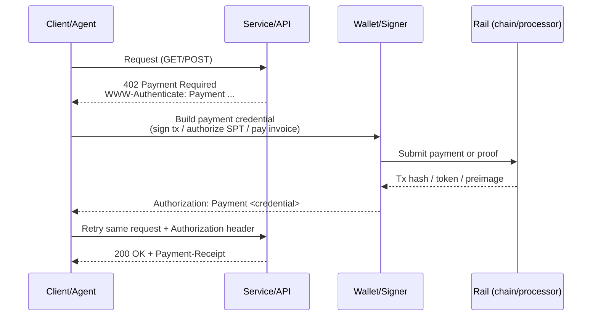
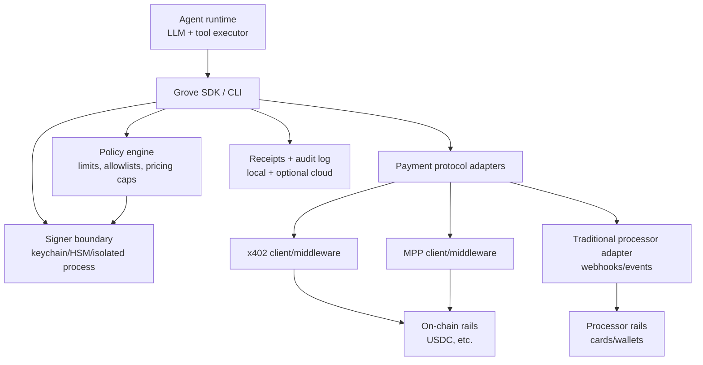

# Payment Agent Skills and CLIs in 2026

## Executive summary

Agent-native payments have converged on a small set of interoperability primitives that let software pay other software without signing up for dashboards, provisioning API keys, or handling invoices manually. Two HTTP status 402 based protocols dominate the “agent pays for API/tool” workflow: **x402** (originating from the Coinbase ecosystem) and **Machine Payments Protocol (MPP)** (co-authored by Stripe and Tempo). Both embed payment negotiation into standard HTTP request/response cycles using `402 Payment Required`, but they differ in how they optimize settlement, rails, and developer experience. citeturn20search9turn5search3turn5search14turn5search20

In practice, “payment agent skills/CLIs” split into three layers:

1. **Payment protocol clients and middleware** (for example: mppx SDK/CLI; x402 middleware and proxies) that implement `402 → pay → retry` loops, receipts, challenge headers, and verification. citeturn23view0turn5search3turn20search9turn20search22
2. **Wallet and key-management toolchains** that store keys, sign transactions, and enforce spending policy (for example: Coinbase AgentKit’s wallet providers and action providers; “agent wallet” CLIs in skill ecosystems). citeturn23view1turn29search9turn10search9
3. **Skill marketplaces and registries** (for example: OpenClaw / ClawHub and AgentSkills-format packaging) that standardize how agents discover and invoke payment capabilities in a repeatable way. citeturn3search11turn20search34turn8search36

The most reusable CLI/UX patterns are stable across ecosystems:

- A “**wallet init / create**” command that writes local state (keystore, config) and prints a deposit address or onramp link. citeturn23view0turn20search13turn10search9
- A “**curl-like request**” command that automatically fulfills `402` challenges and retries. citeturn23view0turn20search13turn5search3
- A “**proxy / gateway**” mode that wraps non-payment-aware upstream APIs behind a payment gate (often serverless). citeturn23view0turn5search13turn20search10
- A “**webhook/event listen**” workflow for traditional payment processors (Stripe CLI remains the canonical reference UX for this). citeturn6search1turn6search19

Security reality: the moment agents run local CLIs and install dependencies, the attack surface includes **supply-chain attacks** on package registries and **prompt-based secret exfiltration** targeting local AI CLIs. Grove should treat “safe-by-default key custody + minimized secret exposure + verifiable receipts + policy controls” as foundational, not optional. citeturn8search33turn15search8turn16search12

## Reference architecture and taxonomy

### Protocol-level flow

Both x402 and MPP formalize the same high-level state machine: request a resource, receive a `402 Payment Required` with a challenge, fulfill the challenge (pay/sign), retry with an authorization credential, and receive the resource plus a receipt. citeturn20search9turn5search3turn5search14

MPP explicitly positions itself as payment-method agnostic with multiple payment methods (stablecoins via Tempo, cards via Stripe shared payment tokens, Lightning, and custom methods) within the same `402` negotiation interface. citeturn5search14turn5search3turn5search4

x402 frames itself as an “internet native payments” open standard intended to support multiple networks and “forms of value” (crypto and fiat). citeturn20search9

### Where “skills” fit

Skill packaging is converging toward a “folder of instructions, schemas, and invocation patterns” that agents can discover and run consistently, with ecosystem-specific runtimes. Cursor’s Agent Skills framing describes skills as a standard way for agents to load domain workflows and tooling. citeturn20search34

Parallel to that, there is an emerging open “agentskills” packaging format used by community tooling to bundle agent documentation with distributable artifacts. citeturn8search36

OpenClaw’s ecosystem adds a marketplace/distribution layer (ClawHub) for these skills, plus operational guidance and (notably) security narratives about proper removal and access revocation. citeturn3search11turn16search12

## Inventory of existing payment agent skills and CLIs

This inventory prioritizes primary sources (official docs, repos, changelogs) and then supplements with community write-ups and discussions when they expose real developer behavior or pain.

### Agent-native payment protocols and toolchains

| Item                        | What it is                                                                        | Primary distribution                                           | License / openness                                                                               | Core “agent payments” role                                                                         |
| --------------------------- | --------------------------------------------------------------------------------- | -------------------------------------------------------------- | ------------------------------------------------------------------------------------------------ | -------------------------------------------------------------------------------------------------- |
| x402                        | HTTP 402 based open payment protocol with middleware examples                     | GitHub repo + CDP docs                                         | Open source spec + reference code citeturn20search9                                           | Standardizes `402` challenges and verification for paywalled APIs/tools                            |
| MPP                         | HTTP 402 based Machine Payments Protocol                                          | Stripe docs + IETF-oriented spec mention + sample repo         | Open protocol; implementation ecosystem is mixed citeturn5search3turn5search14turn5search0  | Adds multiple payment methods (crypto + fiat) and receipts under one auth scheme                   |
| mppx                        | TypeScript SDK + CLI implementing MPP client/server/proxy patterns                | GitHub + npm install command in README                         | MIT citeturn23view0                                                                           | “Fetch that auto-pays 402”, plus middleware and proxy building blocks                              |
| Coinbase AgentKit           | Wallet + action provider toolkit for onchain agents, with framework extensions    | GitHub + CDP docs + CLIs for scaffolding                       | Open source repo; integrates CDP services citeturn23view1turn29search9turn28search5         | Provides wallet mgmt + onchain actions that can be used to pay or monetize agents                  |
| AgentCash                   | A CLI + skills bundle positioned as “fund wallet, access paid resources via x402” | Skill registries + ecosystem listings + downstream agent repos | Mixed (tooling + skills are partially public) citeturn20search1turn22search10turn20search13 | Wallet-funded access to paid endpoints using x402-style flows                                      |
| OpenPayment                 | CLI/SDK to create USDC payment links “powered by x402”                            | GitHub + ClawHub skill                                         | Open source claim in repo landing snippet citeturn6search26turn22search5                     | Lightweight “payment request” creation and link-based UX                                           |
| Open Payments (Interledger) | Open API standard for interoperable initiation/quotes/grants                      | GitHub + openpayments.dev                                      | Open standard, community-driven citeturn6search5turn12search14                               | More “bank/wallet interoperability” than agent micropay-per-call, but relevant for regulated rails |

### Skill marketplaces and packaging ecosystems

OpenClaw is positioned as a locally running autonomous agent with a large integration surface, and ClawHub provides a marketplace-style distribution channel for skills, including wallet and payment-related skills. citeturn19search7turn3search11turn10search9

AgentSkills-format registries commonly store SKILL.md style instruction bundles that map user intents to concrete CLI calls (for example, “use `npx <tool> fetch` for endpoint X”), which is particularly relevant for payments because the invocation pattern must be deterministic and auditable. citeturn20search7turn8search36

### Traditional payments CLI reference point

**Stripe CLI** remains the canonical “payments developer CLI” for non-agent workflows: it supports API object management, webhook testing, and event triggering. It is not “agent-native” by design, but its UX patterns around auth, environment separation, and event handling are often copied. citeturn6search1turn6search19

### Emerging wallet-layer standardization

MoonPay is positioning an “Open Wallet Standard” concept as the missing layer that makes protocols like x402 and MPP usable across multiple agents/tools without fragmenting funds into separate wallets, highlighting encrypted vault storage and “private key never exposed to the agent/LLM” as a design goal. citeturn4search22turn12search18

## Technical capabilities and UX patterns

### Capability matrix (payments and agent integration)

This table focuses on the capabilities you requested: APIs supported, auth, currencies, on/off-chain, wallets, smart contract interactions, webhooks/events.

Legend: ✅ native support, ◐ partial/implementation-dependent, ❌ not a focus, “n/a” unknown from primary sources reviewed.

| Tool / ecosystem  | Rails supported                                                                                                                    | Auth model for agent                                                                                                  | Currency and chain focus                                                                                     | Wallet / key mgmt                                                                                       | Smart contract interaction                                                                                 | Webhooks / events                                                                          | Notes                                                                                             |
| ----------------- | ---------------------------------------------------------------------------------------------------------------------------------- | --------------------------------------------------------------------------------------------------------------------- | ------------------------------------------------------------------------------------------------------------ | ------------------------------------------------------------------------------------------------------- | ---------------------------------------------------------------------------------------------------------- | ------------------------------------------------------------------------------------------ | ------------------------------------------------------------------------------------------------- |
| x402              | On-chain stablecoin payments (design goal: multi-network, crypto + fiat) citeturn20search9                                      | `402` challenge + payment credential in request retry citeturn20search9                                            | Commonly USDC on Base in ecosystem references; protocol aims broader citeturn20search9turn20search1      | ◐ Depends on client (wallet held by agent, or delegated signer)                                         | ◐ Verification middleware typically checks on-chain payment events                                         | ❌ No webhook focus; receipt headers and verification are core                             | Best viewed as protocol + middleware pattern citeturn20search9turn20search22                  |
| MPP               | Stablecoins (Tempo), fiat (cards/wallets via Stripe SPT), Lightning, custom methods citeturn5search14turn5search3turn5search4 | `402` + `WWW-Authenticate: Payment` challenge + `Authorization: Payment` credential citeturn5search14turn5search3 | Explicitly supports both fiat and crypto payment methods citeturn5search3                                 | ◐ Depends on chosen method (on-chain signer vs processor token)                                         | ◐ On-chain methods require signing and sometimes escrow-like flows                                         | ❌ Focus is receipts; not classic webhooks                                                 | Stripe notes stablecoin acceptance constraints in its account context citeturn5search3         |
| mppx              | MPP (Tempo method in SDK; proxy can gate other APIs) citeturn23view0                                                            | Client installs a fetch handler that auto-pays 402; CLI is curl-like citeturn23view0                               | Example config shows contract addresses and recipient; uses Tempo method citeturn23view0                  | ✅ CLI supports account creation stored in keychain (testnet autofund mentioned) citeturn23view0     | ✅ Server middleware verifies and returns receipt; proxy routes can meter per endpoint citeturn23view0  | ◐ Supports streaming patterns (SSE “pay-per-token”) citeturn23view0                     | Strong reference UX for agent-native `402` loops citeturn23view0turn5search8                  |
| Coinbase AgentKit | Onchain actions via wallet providers + action providers citeturn23view1turn29search9                                           | CDP API keys for some capabilities; wallet provider abstraction for signing citeturn23view1turn38search13         | Examples show Base Sepolia; broader network/tooling support via providers citeturn23view1                 | ✅ “Secure wallet management” is explicit positioning citeturn29search9turn23view1                  | ✅ Explicitly supports transfers, swaps, deployments via action providers citeturn29search9turn23view1 | ❌ Not positioned as webhook system                                                        | Extends to MCP and other frameworks via extension packages citeturn23view1turn40view0         |
| AgentCash         | x402-based paid endpoint access with local wallet file pattern citeturn20search13turn22search10turn20search1                  | “Payment is authentication” framing in skill docs citeturn20search13                                               | USDC on Base is repeatedly referenced in ecosystem and downstream setup citeturn22search10turn20search13 | ✅ Creates local wallet JSON (home dir) and supports deposit flows citeturn22search10turn20search13 | ◐ Primarily used to pay APIs; contract interactions are incidental                                         | ◐ Depends on endpoint; focus is paid API calls                                             | Often paired with skill bundles mapping endpoints to commands citeturn20search7turn20search13 |
| OpenPayment       | x402-powered USDC payment links + APIs citeturn6search26turn22search5                                                          | Likely “create payment request” rather than “auto-pay 402”                                                            | USDC emphasized; Base mentioned in skill copy citeturn6search8turn6search26                              | ◐ Depends on how link resolves; CLI creates link, not full custody stack                                | ❌ Not a general contract tool                                                                             | ❌ Not a webhook tool                                                                      | Good lightweight “request money” primitive citeturn6search26turn22search5                     |
| Stripe CLI        | Stripe card and alternative payment methods (traditional) citeturn6search19                                                     | Auth via Stripe API keys; separate live vs test contexts                                                              | Fiat denominated; Stripe supports many currencies (not enumerated here)                                      | ❌ Not a wallet                                                                                         | ❌ Not on-chain                                                                                            | ✅ Webhook listen/trigger workflows are a core CLI value citeturn6search1turn6search19 | Reference UX: `listen`, `trigger`, log tailing citeturn6search1                                |

### Common CLI commands and UX patterns

This table is normalized across the tools above: command names vary, but the underlying user journeys are similar.

| UX goal                            | Pattern                                                                                  | Concrete examples from sources                                                                                                                                                                                                                                    |
| ---------------------------------- | ---------------------------------------------------------------------------------------- | ----------------------------------------------------------------------------------------------------------------------------------------------------------------------------------------------------------------------------------------------------------------- |
| Initialize identity and keys       | `account create` / `wallet create` writes local state; often keychain-backed if possible | `mppx account create` (stored in keychain; testnet autofund mentioned) citeturn23view0; `npx agentcash wallet create` writes `~/.agentcash/wallet.json` in downstream setup docs citeturn22search10turn20search13                                          |
| Fund wallet / authorize spending   | “deposit” step prints an address or link; sometimes includes invite codes / credits      | `npx agentcash wallet deposit` and `wallet info`/`wallet redeem` are explicitly documented in the skill copy citeturn20search13turn22search10                                                                                                                 |
| Make a paid call                   | Curl-like call that auto-handles `402`                                                   | `mppx example.com` (auto payment handling) citeturn23view0; skill docs repeatedly instruct “use `npx agentcash@latest fetch` for endpoint X” citeturn20search7turn20search13                                                                               |
| Wrap existing APIs behind payments | Proxy/gateway mode that applies payment policy as middleware                             | `mppx` exports a Proxy handler and shows routing and pricing per route citeturn23view0; Cloudflare Worker “payment-gated proxy” implementation for MPP citeturn5search13; AWS samples show serverless x402 verification citeturn20search10turn20search6 |
| Develop/test local event flows     | “Listen/tail/trigger/resend” event UX                                                    | Stripe CLI emphasizes webhook testing and log tailing citeturn6search1turn6search19                                                                                                                                                                           |

### Integration points: SDKs, adapters, middleware

Across ecosystems, integrations tend to cluster into repeatable adapter types:

1. **HTTP middleware**: add payment gating to handlers (x402 middleware, MPP middleware). citeturn20search9turn5search3turn23view0
2. **Fetch/Axios clients**: intercept `402` and retry with proof/credential. citeturn23view0turn5search8
3. **Reverse proxies**: enable “paid access” without modifying upstream services. citeturn5search13turn23view0turn5search17
4. **Framework extensions**: integrate with agent frameworks and MCP. Coinbase AgentKit explicitly lists multiple “framework-extensions” including LangChain, Vercel AI SDK, and Model Context Protocol. citeturn23view2turn40view0

## Security, compliance, and deployment models

### Security and compliance features found in the ecosystem

**Key custody and signing**

- mppx explicitly calls out keychain storage for accounts created via CLI, which is a strong “local-first secret storage” pattern compared with flat files. citeturn23view0
- Coinbase AgentKit’s positioning highlights “secure wallet management” as a first-class concept, with wallet providers as a modular layer. citeturn29search9turn23view2
- MoonPay’s Open Wallet Standard concept explicitly argues for isolating the private key from the agent/LLM and using an encrypted vault plus policy engine checks before signing. citeturn4search22turn12search18

**Supply-chain and agent-automation threats**

- Open-source package ecosystems have experienced major supply-chain compromises in recent years, with explicit focus on cryptocurrency-draining payloads in compromised dependencies. This is directly relevant because payment CLIs and agent skills often pull in large dependency graphs. citeturn8search33turn6search24
- Attacks have also targeted local AI CLI tools by attempting to get them to search the filesystem for secrets and exfiltrate them, which matters because “agent payments” implies the presence of wallet keys, API tokens, or signing materials locally. citeturn15search8turn22search13

**Compliance and KYC/AML**

- Traditional processors embed compliance regimes by design. Stripe’s machine payments documentation explicitly ties availability and stablecoin acceptance to account status and geography constraints, which is a proxy for “compliance gating is upstreamed into the processor.” citeturn5search3
- For crypto rails, KYC/AML is typically enforced at onramps/offramps and regulated custodians rather than at the protocol itself. This is a key design assumption Grove should make explicit in product scoping (see assumptions section). citeturn20search9turn5search14

### Deployment models observed

| Model                                      | Why it shows up for agent payments                                        | Concrete examples                                                                                                             |
| ------------------------------------------ | ------------------------------------------------------------------------- | ----------------------------------------------------------------------------------------------------------------------------- |
| Local CLI (developer laptop or agent host) | Lowest friction for prototypes; direct key signing; fastest iteration     | mppx CLI and AgentCash wallet file approach; Stripe CLI local webhook testing citeturn23view0turn22search10turn6search19 |
| Cloud/server (API server)                  | Needed to verify proofs, enforce pricing, issue receipts                  | x402 middleware examples; MPP server middleware in mppx; Stripe sample servers citeturn20search9turn23view0turn5search0  |
| Serverless / edge                          | “Monetize any origin without rewriting it”; scale verification and gating | Cloudflare Worker MPP proxy; AWS serverless x402 verification patterns citeturn5search13turn20search10turn20search6      |

## Adoption signals, real-world use cases, and developer pain points

### Adoption signals (measurable proxies)

Because many payment skills are early or fragmented across registries, no single metric is sufficient. GitHub stars and release cadence capture open-source mindshare; “weekly downloads” capture package pull-through; production transaction counts capture real usage.

| Tool / repo              |                                                        GitHub stars (approx, as of Mar 24, 2026) | Release / activity signal                                                       | Registry downloads signal                                                                                                               | Production usage signal                                                                                                       |
| ------------------------ | -----------------------------------------------------------------------------------------------: | ------------------------------------------------------------------------------- | --------------------------------------------------------------------------------------------------------------------------------------- | ----------------------------------------------------------------------------------------------------------------------------- |
| Stripe CLI               |                    ~1.9k stars; active releases (v1.38.2 Mar 23, 2026 shown) citeturn6search4 | Frequent tagged releases citeturn6search4                                    | n/a (not an npm/pypi package)                                                                                                           | Widely used for Stripe integrations (industry standard inference) citeturn6search19                                        |
| mppx                     |                      73 stars; 40 releases; latest release shown Mar 23, 2026 citeturn23view0 | Active tagging and examples in repo citeturn23view0                          | Not captured from registry in sources reviewed                                                                                          | MPP ecosystem is newly launched; see protocol adoption notes below citeturn5search20turn5search18                         |
| Coinbase AgentKit        |                                     ~1.2k stars; forks ~678 in repo summary citeturn30search1 | Large commit history; multiple framework extensions citeturn23view2          | Example npm weekly downloads are visible via Socket for an extension package: 118 weekly downloads for MCP extension citeturn40view0 | Positioned for onchain actions and micropayments; referenced in multiple ecosystem samples citeturn20search6turn29search9 |
| Echo (Merit Systems)     |                                                           536 stars; 52 forks citeturn23view3 | Actively maintained monorepo scaffolding citeturn23view3turn21search3       | n/a in sources reviewed                                                                                                                 | Shows “user pays” LLM inference usage model; adoption details not fully public citeturn21search3turn21search0             |
| Tempo chain / MPP launch | Tempo org has ~1.1k followers; many repos updated Mar 24, 2026 citeturn5search6turn5search12 | Protocol launched Mar 18, 2026 per reporting citeturn5search20turn4search13 | n/a                                                                                                                                     | a16z cites first-week directory stats: 894 agents and 31,000+ transactions citeturn5search18                               |

To cover Python adoption, ClickPy (ClickHouse-powered PyPI analytics) provides package-level download counts. For example, the ClickPy dashboard for `coinbase-agentkit` shows last day/week/month and a displayed total for the package. citeturn29search3turn29search1

### Real-world use cases that show up repeatedly

**Pay-per-request paid APIs and data**
The Parallel integration documentation is explicit that agents can pay per-use for Search/Extract/Task APIs, with the `mppx` CLI handling the full `402` lifecycle and supporting Stripe card payments or Tempo stablecoins. citeturn5search8turn5search3

**“Wrap existing APIs” as paid endpoints**
This is a dominant pattern: instead of convincing every upstream API to adopt x402/MPP, gateways and proxies apply the protocol at the edge, then forward to upstream with their own credentials. mppx shows an explicit proxy that wraps OpenAI and Stripe APIs with per-route pricing controls. citeturn23view0turn5search17turn5search13

**Agent marketplaces and “headless merchants”**
A16z describes an emerging directory/marketplace model where services expose machine-readable catalogs and agents pay per call, with MPP powering the transactions and no checkout UI. citeturn5search18

**Wallet + identity trust stack**
Recent coverage highlights combining micropayments (x402) with human-verification signals (World ID) as a response to the “productive agent traffic vs bot abuse” problem, even if the reporting sources vary in quality. citeturn29search8turn28search16turn29search9

### Developer pain points (what breaks in practice)

**Platform support and local environment friction**
Community write-ups about early MPP usage report CLI installation/platform gaps (macOS/Linux support vs Windows), confusing denomination/precision errors when setting deposit limits, and stateless channel reuse requiring persistence of `channelId` and cumulative spend. citeturn4search25turn23view0

**State management for “sessions” and streaming payments**
MPP introduces session-like semantics (prepaid metered access), and mppx includes examples for multiple paid requests in a single channel plus SSE streaming (“pay per token”). These are powerful but add state persistence requirements that basic curl mental models do not cover. citeturn23view0turn5search14

**Security posture is inconsistent across skill ecosystems**
OpenClaw’s ecosystem has explicit guidance and third-party commentary on revocation and cleanup, implying that “agent tool sprawl” and persistent credentials are a real operational risk. citeturn16search12turn3search11

## Gaps and opportunities for Grove

### Assumptions (explicit, because sources and implementations vary)

- **Currencies**: This report treats **USDC stablecoins** as the default agent-payment currency because it is repeatedly referenced in x402 ecosystem descriptions and early agent payment tooling, but both x402 and MPP are designed to be broader. citeturn20search9turn20search13turn5search14
- **Target market**: Unless specified, “Grove” is assumed to target developers building agent tools and paid APIs, not consumer checkout UX.
- **Compliance regime**: Unless specified, compliance is assumed to be a mix of (a) regulated processors handling KYC/AML for fiat rails and (b) onramp/offramp providers handling identity, while on-chain protocol layers remain mostly identity-agnostic. citeturn5search3turn20search9
- **Threat model**: Assume hostile local environments (dependency compromise, prompt injection into agent CLIs, secret leakage). citeturn8search33turn15search8

### Strategic gap: lack of a unified “payments control plane” for agents

What’s missing across today’s tools is a cohesive control plane that spans:

- Protocol negotiation (`402` challenges across x402 and MPP)
- Key custody and signing boundaries (keychain, HSM, isolated signer)
- Policy enforcement (spend limits, allowlists, per-domain pricing ceilings)
- Observability (receipts, audit logs, reconciliation)
- Interop packaging (skills, MCP tools, SDK adapters)

MoonPay’s argument for a wallet-layer standard and mppx’s proxy/SDK patterns both point in this direction, but the ecosystem remains fragmented. citeturn4search22turn23view0turn5search14

### Recommended Grove architecture

This design deliberately separates “agent orchestration” from “signing and policy,” reflecting real-world supply-chain and secret-exfiltration risks discussed in public security reporting. citeturn15search8turn8search33

### Prioritized feature roadmap for Grove

Effort is estimated as High/Med/Low relative engineering complexity for an experienced team (interfaces, security review, test surface). Rationale cites ecosystem patterns.

| Priority     | Recommendation                                                                                                   | Effort | Rationale grounded in observed gaps                                                                                                                                                                                             |
| ------------ | ---------------------------------------------------------------------------------------------------------------- | -----: | ------------------------------------------------------------------------------------------------------------------------------------------------------------------------------------------------------------------------------- |
| Must have    | Unified `402` client loop with pluggable adapters (x402 + MPP)                                                   |   High | The dominant agent-pay pattern is `402 → pay → retry`, and both protocols converge here. A single abstraction reduces “choose a protocol” burden and enables fallback strategies. citeturn20search9turn5search3turn23view0 |
| Must have    | Isolated signer boundary + policy engine (spend limits, allowlists, per-tool caps)                               |   High | MoonPay’s “key never exposed to agent” pitch and real supply-chain/prompt attacks imply this is non-negotiable for production agent payments. citeturn4search22turn15search8turn8search33                                  |
| Must have    | Receipt normalization + audit logging (local-first, exportable)                                                  |    Med | Both MPP and x402 emphasize receipts/proof. Developers still need reconciliation, debugging, and controllable evidence trails. citeturn5search14turn20search9turn23view0                                                   |
| Should have  | Proxy/gateway mode (wrap upstream APIs behind Grove paywall) including serverless templates                      |    Med | Proxy pattern is repeatedly used (mppx proxy, Cloudflare worker proxy, AWS serverless examples). It enables monetization without rewriting upstream services. citeturn23view0turn5search13turn20search10                   |
| Should have  | Skill packaging toolkit (generate SKILL.md/tool schemas, MCP servers)                                            |    Med | Skill ecosystems are fragmenting. Standardized packaging and deterministic invocation reduces integration costs and improves trust. citeturn20search34turn23view2turn8search36                                             |
| Should have  | “Developer-grade payments UX” borrowed from Stripe CLI (env separation, event simulation, local testing harness) |    Low | Stripe CLI is a mature reference for auth hygiene and event testing. Reusing these patterns improves DX and reduces mistakes. citeturn6search19turn6search1                                                                 |
| Nice to have | Wallet portability and “shared vault” interop (align with Open Wallet Standard direction)                        |    Med | Ecosystem pressure suggests wallet fragmentation is a real friction point, especially when agents use multiple tools. citeturn4search22turn12search18                                                                       |
| Nice to have | Multi-method routing and fallback (Tempo stablecoin, cards via Stripe SPT, Lightning)                            |   High | MPP is explicitly multi-method; developers will want “pay however agent can” behavior to prevent “wrong-chain stuck” failures. citeturn5search14turn5search4turn5search3                                                   |

### Practical product positioning for Grove

If Grove wants to win developer mindshare quickly, the evidence suggests a wedge strategy:

- **Start where pain is highest**: production-safe key custody + policy + unified `402` loop. This is where early tools are either too low-level (protocol-only) or too opinionated to embed broadly. citeturn23view0turn20search9turn4search22
- **Adopt the proxy pattern early**: it creates immediate value for sellers who want to monetize existing APIs, not rebuild them. citeturn5search13turn5search17turn20search10
- **Treat “skill packaging” as a distribution channel, not just a format**: the ecosystem already has registries and marketplaces. Grove should generate compatible artifacts and let distribution happen in those venues while Grove focuses on safety and protocol correctness. citeturn3search11turn20search34turn8search36
